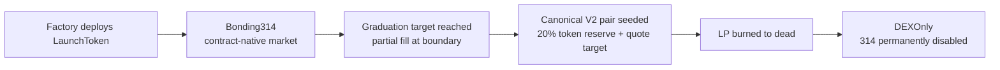

# Autonomous 314 Launch Protocol

[Language Index](./README.i18n.md) | [English](./README.md) | [简体中文](./README.zh-CN.md)

[](./LICENSE)


Open-source **EVM-native** launch protocol for creator-first, platform-independent token launches. Pre-graduation trading lives inside the launch contract itself, and graduation hands liquidity off to a canonical V2-style DEX without requiring a centralized launch platform to remain online.

> Not another launchpad website — a self-contained launch protocol where the contract itself is the market, the reserve system, and the graduation engine.

## One-line thesis

Launches should not need a platform to exist.

Autonomous 314 is built around a simple thesis:

- the market should live in the contract
- the graduation path should live in the contract
- the project should keep most of the launch fee surface
- the frontend should be replaceable
- the protocol should still function if the official website disappears

## Protocol goals

Autonomous 314 is built with four concrete goals:

1. **Make launches platform-independent**
   - a project should still be launchable and tradable even if the official frontend disappears
2. **Shift launch economics toward creators**
   - the protocol should be sustainable, but the majority of launch trading fees should stay on the project side
3. **Reduce launch-stage fragility**
   - avoid the most obvious weaknesses of older 314-style markets, especially around fragmented markets and messy graduation handoffs
4. **Publish a reusable open EVM primitive**
   - not just a website, but a protocol other frontends, wallets, bots, and platforms can adopt

## Core capabilities

At a functional level, the protocol already provides:

- **factory-based launch deployment**
  - deploys new launch instances with immutable profile parameters
- **contract-native pre-grad trading**
  - the launch contract itself runs the market before graduation
- **single-market pre-grad flow**
  - ordinary transfers are restricted before graduation to reduce side-market fragmentation
- **graduation to a canonical V2-style DEX**
  - 20% token reserve plus immutable quote target seeds the canonical pair
- **post-grad hard cutover**
  - after graduation, 314 is permanently disabled and the token behaves like a normal transferable asset
- **creator-first fee accounting**
  - 1% total fee split into 0.7% creator and 0.3% protocol
- **abandoned creator-fee resolution**
  - abandoned pre-grad launches can eventually sweep unclaimable creator fees into the protocol vault
- **reference integration stack**
  - a reference frontend, a bounded-cost indexer, and a local demo flow are included
- **official vanity create flow**
  - the reference frontend locally mines a `CREATE2` salt so official launches default to addresses ending in `0314`
- **creator anti-MEV create entrypoints**
  - `0314` and `1314..9314` support factory-level `create + atomic buy`, while `b314` and `f314` support `create + atomic whitelist seat commit`
- **rich launch metadata flow**
  - the create UI supports description, image, website, and social links while keeping only `metadataURI` on-chain
- **mode-based launch families**
  - `0314`, `b314`, `1314..9314`, and `f314` are first-class protocol families instead of ad hoc frontend presets
- **protocol-ops batch tooling**
  - the factory can batch-claim protocol fees and batch-sweep abandoned creator fees across many launches

See [`docs/LAUNCH_METADATA.md`](docs/LAUNCH_METADATA.md) for the recommended metadata schema.
See [`docs/V2_DOWNSTREAM_CHECKLIST.md`](docs/V2_DOWNSTREAM_CHECKLIST.md) for the current V2 downstream implementation checklist.

## Launch families and suffixes

The protocol is now organized as a small launch-family kit instead of a single launch flavor:

| Family | Suffix | Whitelist | Tax | Creator anti-MEV path | Typical use |
|---|---|---:|---:|---|---|
| Standard | `0314` | No | No | `create + atomic buy` | cleanest default launch |
| Whitelist | `b314` | Yes | No | `create + atomic whitelist seat commit` | fixed-seat whitelist / presale launch |
| Taxed standard | `1314..9314` | No | Yes (`1%..9%`) | `create + atomic buy` | post-grad tokenomics with buy/sell tax |
| Whitelist + tax | `f314` | Yes | Yes | `create + atomic whitelist seat commit` | whitelist launch that later enables post-grad tax |

Important suffix rules:

- `1314..9314` directly encode the standard-family tax rate
- `f314` only means **whitelist + tax family**; the actual tax rate must be read from `taxConfig()`
- batch ops such as protocol fee sweeping and claiming are protocol tooling, not end-user UI features

## 5-minute launch platform kit

Autonomous 314 is not only a protocol for one official site. It is intended to be a **launch platform kit**:

- deploy a factory profile
- point a frontend at that factory
- run a lightweight indexer or even a static snapshot flow
- launch, trade, graduate, and index without building a separate swap backend

In other words, the goal is that anyone can stand up a usable meme launch platform in minutes, with lower backend cost and more launch modes than typical closed launchpad websites.

## What problem this solves

This protocol is designed to solve a specific class of launch problems:

- creators should not need to rent access to a platform just to get a market
- pre-grad trading should not depend on a centralized UI remaining online
- graduation should not be a manual platform operation
- the protocol should expose clear integration points for third parties
- the launch flow should be understandable as a contract system, not hidden platform logic

## Why this exists

Most launch platforms normalize platform rent:

- they own the user flow
- they own discovery
- they often capture the full launch fee surface
- and projects depend on the platform UI to exist as a usable market

Autonomous 314 takes the opposite view:

- the **launch contract itself** is the market, reserve system, and graduation state machine
- the protocol is **open and composable**, so anyone can build their own frontend, wallet flow, or indexer on top
- the economics are **creator-first**, with more of the fee staying with the project instead of being fully extracted by a platform
- the official frontend is a **reference implementation**, not the gatekeeper

## What makes it different

Compared with a typical launchpad model, Autonomous 314 is intentionally opinionated:

- **contract-native market before graduation** instead of forcing all discovery and execution through a platform-owned pool manager
- **single-market pre-grad flow** instead of encouraging fragmented trading venues before the token is ready for a public DEX market
- **creator-first fee split** instead of platform-first rent extraction
- **graduation as a contract state transition** instead of a platform-controlled operational step
- **open integration surface** so wallets, bots, indexers, or white-label frontends can integrate the protocol without asking for permission

## Non-goals

This protocol does **not** try to be all things at once.

It is not trying to:

- replace every off-chain UX layer with on-chain logic
- eliminate all MEV on public blockchains
- become a fully general AMM framework
- force all deployments to use one official frontend or one official indexer
- turn the official website into a mandatory gatekeeper

## Who this is for

Autonomous 314 is designed for:

- **creators** who want a launch flow without surrendering the entire fee surface to a platform
- **communities** that want a launch primitive they can run through their own frontend or tooling
- **wallets** that want to integrate launch flows directly
- **builders** who want a reusable EVM launch protocol instead of a closed launch website
- **platforms** that want to adopt an open protocol instead of owning the entire market path

## Protocol model

- **pre-graduation**: protocol-native 314 bonding market
- **graduation**: immutable per-factory quote target + 20% token reserve seeds the canonical V2 pair
- **post-graduation**: 314 permanently disabled, standard ERC-20 transfers enabled
- **LP handling**: minted directly to the dead address
- **fees**: 1% total = 0.3% protocol + 0.7% creator
- **abandoned creator fees**: if a launch is still pre-graduation after `180 days` and has had no trades for `30 days`, anyone may sweep the unclaimable creator fee vault into the protocol fee vault
- **safety**: quote-side wrapped-native preload is surfaced as a non-canonical opening-state warning rather than a cheap graduation DOS path
- **deployment**: factory supports `CREATE2` salts for vanity suffix search such as `0314`

## Lifecycle



## Architecture at a glance

The system has four practical layers:

1. **Factory**
   - deploys launch instances
   - sets immutable launch profile parameters
   - supports vanity `CREATE2` salts
2. **LaunchToken**
   - runs the pre-grad market
   - tracks reserves and fee vaults
   - owns graduation state transitions
3. **Reference frontend**
   - safe default execution path
   - token workspace, charts, activity, claim actions
4. **Reference indexer**
   - bounded-cost activity and segmented chart APIs
   - optional convenience layer, not the protocol truth source

## State machine

Each launch moves through a narrow, explicit state machine:

- `Created`
  - deployed and initialized
- `Bonding314`
  - contract-native pre-grad market is live
  - ordinary transfers are restricted
- `Migrating`
  - graduation path is executing
  - internal market is freezing and canonical V2 handoff is taking place
- `DEXOnly`
  - 314 is permanently disabled
  - the token behaves like a normal post-launch ERC-20/BEP-20 style asset

## Anti-MEV and market-integrity design

This protocol does **not** claim to eliminate MEV. It does try to reduce the easiest and most damaging launch-stage extraction paths.

Current design choices include:

- **pre-grad transfer lock** to reduce private side markets before graduation
- **1-block sell cooldown** to blunt same-block round-trip behavior
- **explicit buy/sell paths with slippage protection** as the intended execution path
- **partial fill at graduation boundary** so the market cannot overshoot the target in a single trade
- **post-grad hard cutover** so the protocol does not keep a permanent second market alive after DEX launch
- **quote-side preload compatibility** so stray wrapped-native deposits do not trivially DOS graduation, while the frontend still surfaces non-canonical opening state when preload exists
- **mode-specific creator anti-MEV entrypoints** so creators can atomically buy or atomically reserve their own whitelist seat at creation time

The protocol intentionally keeps **native transfer entrypoints** for the families that are meant to feel like 314:

- `0314` and `1314..9314`: direct native transfer to the launch contract is a valid bonding-phase buy path
- `b314` and `f314`: direct native transfer during the whitelist window is a valid fixed-seat commit path

Reference UIs should still prefer explicit contract calls such as `buy(minTokenOut)` for everyday execution, but integrations must not assume `receive()` is disabled.

## Creator-first economics

The protocol is deliberately positioned against platform-first fee extraction.

- **creator share**: `0.7%`
- **protocol share**: `0.3%`
- **standard/taxed create fee**: `0.01 native`
- **whitelist/whitelist-tax create fee**: `0.03 native`

This means the protocol keeps a small sustainability fee while routing the majority of the trading fee back toward the project side.

Very small dust-sized trades are also protected against fee bypass. In practice this means extremely small buys or sells may either pay a minimum 1 wei total fee or become non-executable if the net output would be zero after fees.

### Fee policy

- **creator fee** accrues during pre-grad but is only claimable after graduation
- if a launch is abandoned and never graduates, creator fee does not remain stuck forever
- after `180 days` of age and `30 days` of inactivity, anyone may sweep abandoned creator fees into the protocol fee vault

This keeps the protocol creator-first while still giving dead launches a clean terminal state.

## Trust and control assumptions

The protocol is designed to minimize platform dependence, but it is still important to understand the trust boundaries:

- the **launch contract** is the source of truth for pre-grad state
- the **reference frontend** is optional convenience, not protocol authority
- the **reference indexer** is a bounded-cost read layer, not the state authority
- the **canonical DEX handoff** depends on a V2-compatible router/factory/pair model on the target chain
- the **factory profile** determines immutable per-launch parameters such as graduation target

In practice, the protocol aims to reduce platform custody and platform gatekeeping, not pretend that off-chain UX layers no longer matter at all.

## Decentralization stance

Autonomous 314 is designed to fit Web3 values more closely than a closed launch website:

- launches do **not** need a platform backend to exist
- pre-grad trading does **not** depend on an external swap UI
- graduation is handled by the launch contract’s own state machine
- any third party can build:
  - a frontend
  - an indexer
  - a wallet integration
  - a bot integration
  - a white-label launch site

In other words, this repository is meant to be a **self-contained open launch system**, not just another launchpad frontend.

## Positioning

This repository is the **EVM-generic core**.

The current **official launch profile** is:

- chain: **BSC**
- DEX: **PancakeSwap V2**
- wrapped native quote: **WBNB**
- graduation target: **12 BNB**
- standard/taxed create fee: **0.01 BNB** (repository V2 default)
- whitelist/whitelist-tax create fee: **0.03 BNB** (repository V2 default)
- default protocol treasury fallback: **`0xC4187bE6b362DF625696d4a9ec5E6FA461CC0314`**

If a factory deployer passes `address(0)` as the protocol fee recipient, the factory falls back to the default treasury above. Deployers can still override it explicitly.

The codebase is being kept generic so the same protocol can be deployed on other EVM chains that provide:

- a wrapped native token
- a V2-compatible factory/router/pair model
- predictable chain configuration for frontend + indexer profiles

## Open-source boundary

This repository is intended to be usable as a protocol, not merely inspected as a code sample.

Included:

- contracts
- tests
- deployment scripts
- local demo
- reference frontend
- reference indexer/API
- protocol and integration docs

Not assumed:

- a mandatory platform backend
- a mandatory official UI
- a mandatory official indexer
- a proprietary market-ops layer to keep launches alive

## What the reference apps are for

This repository includes a reference frontend and a reference indexer, but they exist to demonstrate and standardize integration patterns:

- the **frontend** shows a safe default way to create, trade, claim, and monitor a launch
- the **indexer** shows a bounded-cost way to build activity feeds and segmented charts
- neither component is meant to be the only possible interface

The protocol should remain usable through wallets, scripts, custom UIs, or alternative infrastructure providers.

## Graduation target profiles

- **official BSC profile**: `12 BNB`
- **local/dev/test profile**: lower immutable targets such as `0.2 native` for fast graduation tests

The graduation target is configured at **factory deployment time** and passed into each `LaunchToken` as an immutable value.

## Workspace layout

- `packages/contracts` — Solidity contracts, tests, scripts
- `apps/web` — reference frontend
- `apps/indexer` — bounded-cost reference indexer/API
- `docs` — protocol, integration, and demo docs

## Local demo

You do **not** need a public testnet faucet for end-to-end testing.

```bash
pnpm demo:local
```

This starts a local Hardhat chain, deploys a demo factory with a `0.2 native` graduation target, starts the indexer API, and launches the reference web app.

See:

- [docs/LOCAL_DEMO.md](./docs/LOCAL_DEMO.md)
- [docs/BSC_FACTORY_DEPLOYMENT.md](./docs/BSC_FACTORY_DEPLOYMENT.md)

## Official BSC deployment

- **Factory:** `0xB7cc1e41D997667fa1e1314415b3F2ec815D0314`
- **Chain:** BNB Smart Chain
- **Router:** PancakeSwap V2 Router `0x10ED43C718714eb63d5aA57B78B54704E256024E`
- **Modes:** `0314 / b314 / 1314..9314 / f314`
- **Support deployers:** `0x502C1605B17E2c0B67Dd4C855E095989945aB3cc` / `0xA45921Dc733188c8C68D017984224E0EC125b095` / `0xf0Ef9342fB2866580F4d428E6FF00E5394E15182` / `0x8Cb985D86eAdF6D92d9204338583332e2A8313F0`
- **Create fees:** standard/tax `0.01 BNB`, whitelist/f314 `0.03 BNB`
- **Graduation target:** `12 BNB`

The reference web app is intended to be deployed from the monorepo root on Vercel using [`vercel.json`](./vercel.json). The reference indexer/API is intended to be deployed from the monorepo root on Railway using [`railway.json`](./railway.json).

## Quick start

```bash
pnpm install
pnpm build
pnpm test
pnpm demo:local
```

After that you can open the local reference frontend and run a full create → trade → graduate flow without a public faucet.

## Vanity suffix strategy

The protocol uses suffixes as **mode identity markers** first, and vanity/branding only second.

Recommended priority:

1. **official factory** — best effort to end with `0314`
2. **standard launches** — `0314`
3. **whitelist launches** — `b314`
4. **taxed standard launches** — `1314..9314`
5. **whitelist + tax launches** — `f314`
6. **public protocol treasury / ops EOAs** — optional vanity if useful for branding

Bundled helpers:

```bash
pnpm vanity:eoa -- --suffix 0314
pnpm vanity:factory -- --suffix 0314 ...
pnpm vanity:launch -- --suffix 0314 ...
```

Operational guidance:

- use vanity mining for the **official factory** if you want a canonical, memorable protocol address
- do **not** force vanity mining on every creator launch
- for creator launches, only mine a suffix when the creator explicitly cares about it

Important caveat:

- launch vanity results only remain valid for the **exact final launch parameters and launch family**
- if you change factory address, creator, name, symbol, metadata URI, router, fee recipient, or graduation target, the predicted vanity launch address changes too

This is why the repository treats `0314` as a **best-effort identity layer**, not a hard dependency for protocol correctness.

## Current status

The repository already includes:

- core launch contracts
- tests for the main graduation and fee paths
- a reference frontend
- a reference indexer/API
- a local demo flow with low graduation target for fast iteration

The current official operating profile is **BSC-first**, while the codebase itself is kept **EVM-generic**.

The repository baseline now includes the full V2 family design:

- `0314`
- `b314`
- `1314..9314`
- `f314`
- protocol batch ops for sweeping and claiming fee surfaces at scale

## Build and test

```bash
pnpm build
pnpm test
pnpm --filter @autonomous314/contracts gas:report
```

## Open-source status

This repository is being prepared as a public open-source protocol repo:

- contracts + tests included
- reference frontend included
- reference indexer included
- local demo included
- BSC is the first official runtime profile

## Long-term direction

The aim is not to become another gatekeeping launch website.

The aim is to make this protocol good enough that:

- creators can launch without surrendering the full fee surface to a platform
- communities can run their own frontend or indexer
- wallets can integrate launches directly
- other platforms can adopt the protocol instead of owning the whole market flow

If this succeeds, the value of the system comes from open adoption, composability, and credible creator-first economics — not from forcing every launch through a centralized funnel.

## FAQ

### Is this just another launchpad?

No. The aim is to make the launch contract itself carry the critical market and graduation logic, while the frontend and indexer remain replaceable.

### Does this remove MEV?

No. It reduces some of the easiest launch-stage extraction paths, but it does not claim to eliminate all MEV on public blockchains.

### Can this work without the official frontend?

Yes. That is one of the core design goals. The official frontend is a reference implementation, not a required gatekeeper.

### Why give creators more than the protocol?

Because this system is explicitly creator-first. The protocol should be sustainable, but it should not normalize the assumption that platforms deserve the majority of launch fees.

### Is this only for BSC?

No. The codebase is written as an EVM-generic core. BSC is simply the first official runtime profile.
