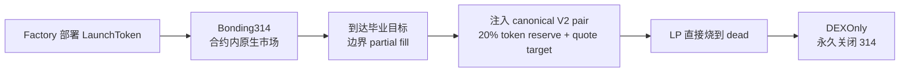

# Autonomous 314 Launch Protocol

[Language Index](./README.i18n.md) | [English](./README.md) | [简体中文](./README.zh-CN.md)

[](./LICENSE)


一个开源的 **EVM 原生** 发射协议，强调 **creator-first**、**平台无关** 和 **合约自治**。在毕业前，交易直接发生在 launch 合约自身；毕业时，流动性自动切换到标准 V2 风格 DEX，而不是依赖某个中心化发射平台继续在线。

> 这不是“又一个发射平台网站”，而是一套自包含的发射协议：合约自身就是市场、储备系统和毕业引擎。

## 一句话主张

**发射不应该依赖平台才能存在。**

Autonomous 314 的基本观点很直接：

- 市场应该在合约里
- 毕业路径应该在合约里
- 手续费的大头应该留给项目方
- 前端应该是可替换的
- 就算官方网站消失，协议本身也应该能继续运行

## 协议目标

Autonomous 314 当前的目标很明确，主要有四个：

1. **让发射不再依赖平台**
   - 即使官方前端消失，项目仍应可以发射、交易和毕业
2. **把 launch 经济模型更多地偏向 creator**
   - 协议需要可持续收入，但大部分交易手续费应该留在项目侧
3. **降低 launch 阶段的脆弱性**
   - 尽量避免旧式 314 在市场碎片化、毕业切换混乱等方面的明显问题
4. **发布一套可复用的开放 EVM primitive**
   - 不只是一个网站，而是一套可以被钱包、机器人、前端、平台复用的协议

## 核心功能

从功能层面看，这个协议当前已经提供：

- **工厂化部署 launch**
  - 通过 factory 批量部署带 immutable 参数的 launch 实例
- **合约原生的毕业前交易市场**
  - 毕业前交易直接在 launch 合约自身发生
- **单市场毕业前流程**
  - 毕业前限制普通转账，减少旁路市场和市场碎片化
- **毕业切换到 canonical V2 DEX**
  - 用 20% token reserve 加 immutable quote target 注入 canonical pair
- **毕业后一刀切**
  - 毕业后永久关闭 314，token 回到正常可转账状态
- **creator-first 手续费记账**
  - 总费 1%，其中 0.7% 给 creator，0.3% 给 protocol
- **废弃 creator fee 处理**
  - 长期不毕业且不活跃项目的 creator fee 可以最终回流 protocol vault
- **参考实现栈**
  - 仓库内已经包含参考前端、低成本 indexer 和本地 demo 流程
- **官方 vanity 创建流程**
  - 参考前端会在本地先挖出 `CREATE2` salt，因此官方创建的新 launch 默认尽量尾号 `0314`
- **creator 的 anti-MEV 创建入口**
  - `0314` 与 `1314..9314` 支持工厂级 `创建 + 原子买入`，`b314` 与 `f314` 支持 `创建 + 原子占白名单席位`
- **富 metadata 创建流程**
  - 创建界面支持描述、图片、官网和社交链接，但链上仍只保留 `metadataURI`
- **模式化 launch 家族**
  - `0314`、`b314`、`1314..9314` 和 `f314` 都是协议层一等公民，而不是前端临时拼出来的选项
- **协议运维批量工具**
  - Factory 可批量领取 protocol fee，也可批量 sweep 长期废弃项目的 creator fee

推荐的 metadata 结构见 [`docs/LAUNCH_METADATA.md`](docs/LAUNCH_METADATA.md)。
当前 V2 下游适配清单见 [`docs/V2_DOWNSTREAM_CHECKLIST.md`](docs/V2_DOWNSTREAM_CHECKLIST.md)。

## Launch 家族与尾号

协议现在不再只有一种 launch，而是一个小型 launch family kit：

| 家族 | 尾号 | 白名单 | 税 | creator anti-MEV 路径 | 典型用途 |
|---|---|---:|---:|---|---|
| 标准版 | `0314` | 否 | 否 | `创建 + 原子买入` | 最干净的默认 launch |
| 白名单版 | `b314` | 是 | 否 | `创建 + 原子占白名单席位` | 固定席位 whitelist / 预售 |
| 标准税版 | `1314..9314` | 否 | 是（`1%..9%`） | `创建 + 原子买入` | 毕业后启用买卖税的 tokenomics |
| 白名单+税版 | `f314` | 是 | 是 | `创建 + 原子占白名单席位` | 先 whitelist，再在毕业后启用税 |

需要特别说明：

- `1314..9314` 直接表达标准税版的税率
- `f314` 只表达“白名单 + 带税家族”，**具体税率要读 `taxConfig()`**
- `b314` / `f314` 现在支持 `whitelistOpensAt`，可在创建后最多 3 天内延迟开启白名单窗口
- 白名单家族是**固定席位**，不是按投入比例浮动分配
- 每个批准地址只能按**精确席位金额**承诺一次
- 一旦达到门槛，白名单自动确认，**每个已填充席位拿到完全相同的代币额度**
- 如果选择延迟开启，creator 的“原子占席位”路径会被禁用，只能先创建、到开启时间后再 commit
- 批量 sweep / batch claim 属于协议运维能力，不是普通用户主界面的按钮

## 5 分钟发射平台套件

Autonomous 314 不只是一个官方前端，而是一套可以被任何人拿去搭建发射台的协议栈：

- 部署一个 factory profile
- 把前端指向这个 factory
- 运行一个轻量 indexer，甚至只用静态 snapshot
- 就能完成创建、交易、毕业和索引

也就是说，它的目标是让任何人都能在几分钟内搭出自己的 meme 发射平台，不需要自己再造 swap 后台，同时拥有比常见封闭 launchpad 更丰富的模式组合。

## 为什么服务器压力不会很大

这个协议从一开始就不是按“重后台平台”来设计的。

最关键的执行路径都被放回了 **链上**：

- 创建通过 factory 完成
- 毕业前交易发生在 launch 合约里
- 毕业在 launch 合约里自动完成
- 毕业后交易回到 canonical V2 DEX

这意味着服务器**不负责**：

- 运行市场撮合
- 托管用户资产
- 做订单簿
- 代执行 swap
- 人工推动毕业

参考服务器被刻意做得很轻，它主要只做：

- launch 列表聚合
- 活动流归一化
- 分段 K 线生成
- 参考前端的 metadata 上传辅助

从工程上看，这会让后端压力比典型平台型 launchpad 小很多，因为：

- 不需要自己维护 swap 引擎
- 不需要托管层
- 不需要链下订单簿
- 不需要重型 launch 编排服务

真正的压力主要是 **RPC 读取压力**，而不是服务器业务逻辑压力。

### 真正可能成为瓶颈的地方

如果后续规模变大，主要压力点通常在：

- RPC / archive log 读取
- launch 列表索引窗口
- 多个 launch 的图表生成
- metadata 与图片托管

这些都需要缓存、分页和有边界的设计，但它们的复杂度和成本，仍然远低于维护一个自有交易引擎的平台。

### 当前的运行模型

当前参考实现其实已经体现了这种“轻后台”思路：

- 前端可直接链上读取关键真相
- indexer 有缓存和边界
- activity / chart 都是 token 级接口
- metadata 发布只是辅助能力，不是协议真相源

所以可以直接把结论写成一句话：

> **这个协议的服务器压力按设计就是低的：执行在链上，后端只承担轻量索引和展示层工作。**

## 这个协议解决什么问题

这个协议要解决的是一类很具体的问题：

- creator 不应该为了获得市场而向平台“租入口”
- 毕业前交易不应该依赖某个中心化前端持续在线
- 毕业不应该是平台后台人工操作
- 协议应该对第三方暴露清晰的集成接口
- launch 流程应该能被理解成一套合约系统，而不是黑盒平台逻辑

## 为什么要做这个

现在很多发射平台都会把“平台租金”默认化：

- 平台掌控用户入口
- 平台掌控发现与分发
- 平台往往吃掉完整的手续费空间
- 项目方和用户都依赖平台前端才能维持可用市场

Autonomous 314 反过来做：

- **launch 合约本身**就是市场、储备系统和毕业状态机
- 协议是**开放且可组合**的，任何人都可以基于它构建前端、钱包流程、索引器或机器人
- 经济模型是 **creator-first** 的，让更多手续费留在项目侧，而不是被平台整体抽走
- 官方前端只是**参考实现**，不是唯一入口，也不是 gatekeeper

如果用一句话概括这个项目的立场，就是：

- **不是平台优先，而是协议优先**
- **不是平台抽成优先，而是 creator-first**
- **不是依赖入口生存，而是合约自身成体系**

## 它和一般 launchpad 最大的不同

和常见平台型发射模型相比，Autonomous 314 是一套更“协议化”的设计：

- **毕业前市场直接内嵌在合约里**，不是主要依赖平台管理器合约或平台前端
- **毕业前尽量只有一个市场**，避免过早形成碎片化交易场所
- **creator-first 手续费分配**，而不是平台先吃最大头
- **毕业是合约状态切换**，不是平台后台操作流程
- **开放集成面**，钱包、索引器、机器人、白标前端都可以无许可接入

## 非目标

这套协议**不是**想一次性做成一切。

它并不打算：

- 用链上逻辑替代所有链下 UX 层
- 宣称消灭公链上的全部 MEV
- 变成一个通用 AMM 框架
- 强迫所有部署都必须使用唯一官方前端或唯一官方 indexer
- 让官方网站重新变成必须经过的 gatekeeper

## 适合谁使用

Autonomous 314 主要适合这些对象：

- **creator**：不想把完整手续费空间让给平台
- **社区**：希望基于开放协议搭自己的前端或工具
- **钱包**：想直接集成 launch 流程
- **开发者**：想复用一套 EVM launch primitive，而不是依赖封闭网站
- **平台**：想采用开放协议，而不是继续把整条市场路径据为己有

## 协议模型

- **毕业前**：协议原生 314 bonding 市场
- **毕业时**：按工厂部署时写死的 quote target + 20% token reserve 注入 canonical V2 pair
- **毕业后**：永久关闭 314，恢复标准 ERC-20 转账
- **LP 处理**：直接 mint 到 dead 地址
- **手续费**：总计 `1%` = `0.3%` 协议 + `0.7%` 创建者
- **废弃 creator fee 回收**：如果项目仍未毕业、创建已满 `180 天` 且最近 `30 天` 无交易，任何人都可将未可领取的 creator fee sweep 到 protocol fee vault
- **安全处理**：graduation pair 中预先注入的 wrapped native quote 不再被当成廉价 DOS 手段；协议会把这类情况明确标记为“非严格 canonical 开盘状态”
- **部署能力**：工厂支持 `CREATE2` salt，可搜索 `0314` 等 vanity 尾号

## 生命周期



## 架构一览

整个系统可以理解成四层：

1. **Factory**
   - 部署 launch 实例
   - 写入 immutable profile 参数
   - 支持 `CREATE2` vanity salt
2. **LaunchToken**
   - 承担毕业前市场
   - 管理储备与 fee vault
   - 承担毕业状态切换
3. **参考前端**
   - 提供默认更安全的交互路径
   - 展示工作区、图表、活动流、claim 操作
4. **参考 indexer**
   - 提供有成本边界的活动流与分段图表 API
   - 它是增强层，不是协议真相源

## 状态机

每个 launch 都会沿着一条明确而狭窄的状态机前进：

- `Created`
  - 已部署并初始化
- `Bonding314`
  - 合约内毕业前市场开启
  - 普通转账受限
- `Migrating`
  - 正在执行毕业迁移
  - 内部市场冻结，向 canonical V2 交接
- `DEXOnly`
  - 314 永久关闭
  - token 进入正常 post-launch 交易状态

## 抗 MEV / 维护市场完整性的做法

这个协议**并不宣称能彻底消灭 MEV**。它做的是：尽量减少最容易伤害 launch 阶段普通用户的那一类提取路径。

当前已经采用的设计包括：

- **毕业前禁普通转账**，减少私池和旁路市场
- **1 个区块卖出冷却**，削弱最短时反向套利
- **官方前端默认走带滑点保护的显式 buy/sell，也是协议的预期执行路径**
- **毕业边界 partial fill**，避免单笔直接冲穿目标
- **毕业后一刀切到 DEXOnly**，不保留永久双市场
- **quote 侧 preload 兼容**，避免 stray wrapped native 轻易卡死毕业，同时在前端明确提示这会让 DEX 开盘状态不再严格 canonical
- **按模式区分的 creator anti-MEV 创建入口**，让 creator 在创建时就能原子买入，或原子抢到自己的白名单席位

协议刻意保留了 **native transfer 入口**，但不同家族的语义不同：

- `0314` 与 `1314..9314`：毕业前直接向合约转原生币，是合法的 314 买入路径
- `b314` 与 `f314`：白名单窗口内直接向合约转原生币，表示固定席位 commit
- 白名单不是按出资比例分配，而是**达到门槛后每个席位获得相同额度的代币**

参考前端仍然应该优先走显式 `buy(minTokenOut)`，但第三方集成不能再假设 `receive()` 被禁用了。

## Creator-first 经济模型

这个协议的设计目标之一，就是对抗平台型的高抽成模式。

- **创建者分成**：`0.7%`
- **协议分成**：`0.3%`
- **标准/税版创建费**：`0.01 native`
- **白名单/白名单税版创建费**：`0.03 native`

也就是说：

- 协议保留一个较小的可持续收入
- 大部分交易费回到项目侧
- 不再默认让平台吃掉完整的 1%

另外，协议现在也会防止极小 dust 交易绕过手续费。实际表现为：极小额买卖要么会支付最小 `1 wei` 总手续费，要么在扣费后净输出为 `0` 时直接不可执行。

### 手续费策略

- **creator fee** 会在毕业前累计，但只有毕业后才能领取
- 如果项目长期不毕业，creator fee 也不会永久卡死
- 当项目 **创建满 180 天** 且 **最近 30 天无交易** 时，任何人都可以把 abandoned creator fee sweep 到 protocol fee vault

这样做的目的，是在 **creator-first** 和 **死项目终局处理** 之间找到平衡。

## 信任边界与控制假设

这个协议的目标，是尽量减少对平台的依赖，但并不是假装所有链下层都不存在。

需要理解的边界包括：

- **launch 合约** 是毕业前状态的真相源
- **参考前端** 是便利层，不是协议权威
- **参考 indexer** 是有成本边界的读层，不是状态真相源
- **canonical DEX handoff** 依赖目标链上的 V2-compatible router/factory/pair
- **factory profile** 决定诸如 graduation target 这类 immutable 参数

也就是说，这个协议追求的是减少平台托管与平台 gatekeeping，而不是否认所有链下 UX 层的存在。

## 去中心化立场

Autonomous 314 比封闭 launch 网站更接近 Web3 精神：

- 发射项目**不需要依赖平台后端**才能存在
- 毕业前交易**不依赖外部 swap UI**
- 毕业流程由 launch 合约自己的状态机执行
- 任何第三方都可以构建：
  - 前端
  - 索引器
  - 钱包集成
  - 机器人集成
  - 白标发射站

换句话说，这个仓库的目标是成为一个**自包含的开放发射系统**，而不是另一个平台型 launchpad 前端。

## 定位

这个仓库是 **EVM-generic core**。

当前的**官方试运行 profile** 是：

- 链：**BSC**
- DEX：**PancakeSwap V2**
- wrapped native quote：**WBNB**
- 毕业目标：**12 BNB**
- 标准/税版创建费：**0.01 BNB**（V2 仓库默认）
- 白名单/白名单税版创建费：**0.03 BNB**（V2 仓库默认）
- 默认协议 treasury fallback：**`0xC4187bE6b362DF625696d4a9ec5E6FA461CC0314`**

如果工厂部署时把 `protocolFeeRecipient` 传成 `address(0)`，工厂会自动 fallback 到上面的默认 treasury 地址。  
当然，自部署者仍然可以显式传入自己的地址进行覆盖。

代码层保持通用，是为了让同一套协议可以部署到其他 EVM 链，只要这些链具备：

- wrapped native token
- V2-compatible factory/router/pair
- 可预测的链配置，便于前端和 indexer profile 切换

## 部署后的治理收口

当前 factory 仍然保留 `Ownable` 管理能力，用于 treasury / deployer 等关键配置。

推荐的生产姿势是：

1. 完成部署
2. 确认 treasury / deployer / router 等参数最终正确
3. 将 ownership 转给 timelock，或在不再需要治理时直接 renounce

在这一步完成前，不应把部署描述为“完全去治理”或“完全不可变”。

## 开源边界

这个仓库的目标不是“只给别人看看代码”，而是作为一套真正可使用的协议参考实现。

仓库中已包含：

- 合约
- 测试
- 部署脚本
- 本地 demo
- 参考前端
- 参考 indexer / API
- 协议与集成文档

它不依赖这些前提才能成立：

- 不依赖强制性的平台后端
- 不依赖唯一官方前端
- 不依赖唯一官方 indexer
- 不依赖一套私有化的运营后台才能让市场继续存在

## 参考前端和参考 indexer 的作用

这个仓库内置了参考前端和参考 indexer，但它们的定位是：

- **前端**：展示一种更安全、默认更合理的 create / trade / claim / monitor 方式
- **indexer**：展示一种有成本边界的活动流与分段图表构建方式
- 它们都不是协议唯一入口

协议本身应该仍然可以通过：

- 钱包
- 脚本
- 自定义 UI
- 第三方基础设施

继续使用和运行。

## Graduation target profiles

- **官方 BSC profile**：`12 BNB`
- **本地 / 开发 / 测试 profile**：可以使用更低的 immutable target，例如 `0.2 native`，方便快速毕业测试

graduation target 会在 **factory 部署时**确定，并作为 immutable 参数传入每个 `LaunchToken`。

## 官方 BSC 部署

- **Factory**：`0x09261904bf6f7Ce23dee2058379A49DF53B80314`
- **模式**：`0314 / b314 / 1314..9314 / f314`
- **Router**：PancakeSwap V2 Router `0x10ED43C718714eb63d5aA57B78B54704E256024E`
- **Support deployers**：`0x502C1605B17E2c0B67Dd4C855E095989945aB3cc` / `0xA45921Dc733188c8C68D017984224E0EC125b095` / `0xf0Ef9342fB2866580F4d428E6FF00E5394E15182` / `0x8Cb985D86eAdF6D92d9204338583332e2A8313F0`
- **创建费**：标准/税版 `0.01 BNB`，白名单/`f314` `0.03 BNB`
- **Graduation target**：`12 BNB`

## 仓库结构

- `packages/contracts` — Solidity 合约、测试、脚本
- `apps/web` — 参考前端
- `apps/indexer` — 有成本边界的参考 indexer / API
- `docs` — 协议、集成与 demo 文档

## 本地 Demo

你**不需要测试网水龙头**，就可以完整验证协议闭环。

```bash
pnpm demo:local
```

它会：

- 启动本地 Hardhat 链
- 部署一个 graduation target 为 `0.2 native` 的 demo factory
- 启动 indexer API
- 启动参考前端

详见：

- [docs/LOCAL_DEMO.md](./docs/LOCAL_DEMO.md)

## 快速开始

```bash
pnpm install
pnpm build
pnpm test
pnpm demo:local
```

执行后，你可以在本地直接跑完整的 create → trade → graduate 流程，不需要测试网水龙头。

## 尾号策略

这个协议把尾号首先当成**模式身份**，其次才是品牌 vanity。

推荐优先级：

1. **官方 Factory** —— 尽量做成尾号 `0314`
2. **标准 launch** —— `0314`
3. **白名单 launch** —— `b314`
4. **标准税版 launch** —— `1314..9314`
5. **白名单税版 launch** —— `f314`
6. **协议公开地址 / 运维地址** —— 如有品牌诉求可再做 vanity

仓库已内置辅助脚本：

```bash
pnpm vanity:eoa -- --suffix 0314
pnpm vanity:factory -- --suffix 0314 ...
pnpm vanity:launch -- --suffix 0314 ...
```

部署建议：

- **官方 Factory** 值得尽量追求 `0314`
- **普通 creator launch** 不要默认强制挖尾号
- 只有当 creator 明确在意地址辨识度时，再用显式 salt 去挖 vanity

要特别注意：

- Launch 地址尾号只对**完全一致的最终参数与 launch 家族**有效
- 只要 factory、creator、name、symbol、metadata URI、router、fee recipient 或 graduation target 任何一个发生变化，预测出的 vanity 地址就会变化

所以在这个仓库里，`0314` 被视为一种**尽力而为的身份层**，而不是协议正确性的依赖项。

## 当前状态

当前仓库已经包含：

- 核心发射合约
- 主流程测试
- 参考前端
- 参考 indexer / API
- 低 graduation target 的本地 demo 流程

当前官方运行策略是 **BSC-first**，但代码层本身保持 **EVM-generic**。

仓库中的 V2 基线现在已经覆盖：

- `0314`
- `b314`
- `1314..9314`
- `f314`
- 面向大规模运维的 batch sweep / batch claim 能力

## 构建与测试

```bash
pnpm build
pnpm test
pnpm --filter @autonomous314/contracts gas:report
```

## 开源状态

这个仓库正在被打磨成一个公开的开源协议仓库，当前已包含：

- contracts + tests
- reference frontend
- reference indexer
- local demo
- BSC 作为首个官方试运行 profile

## 长期方向

这个项目的目标，不是变成又一个必须经过的平台漏斗。

真正的目标是：

- creator 可以发射，而不必把完整手续费空间让渡给平台
- 社区可以自己运行前端或 indexer
- 钱包可以直接集成 launch 流程
- 其他平台也可以采用协议，而不是继续垄断整个市场路径

如果这件事做成了，协议的价值会来自：

- 开放采用
- 可组合性
- 可信的 creator-first 经济模型

而不是来自“所有项目都必须经过某个平台网站”。

## FAQ

### 这是不是另一个 launchpad？

不是。它的目标是让 launch 合约本身承载关键市场与毕业逻辑，而前端和 indexer 只是可替换的参考实现。

### 这能彻底消灭 MEV 吗？

不能。它能降低一部分 launch 阶段最容易伤害普通用户的提取路径，但不会宣称消灭公链上的全部 MEV。

### 没有官方前端还能用吗？

可以。这正是它的核心设计目标之一。官方前端只是参考实现，不是必须经过的 gatekeeper。

### 为什么 creator 分成比协议高？

因为这套系统明确是 creator-first。协议需要可持续收入，但不应默认平台天然应该吃掉大部分 launch 手续费。

### 这是不是只适用于 BSC？

不是。代码层是 EVM-generic core，只是当前先用 BSC 作为首个官方试运行 profile。
